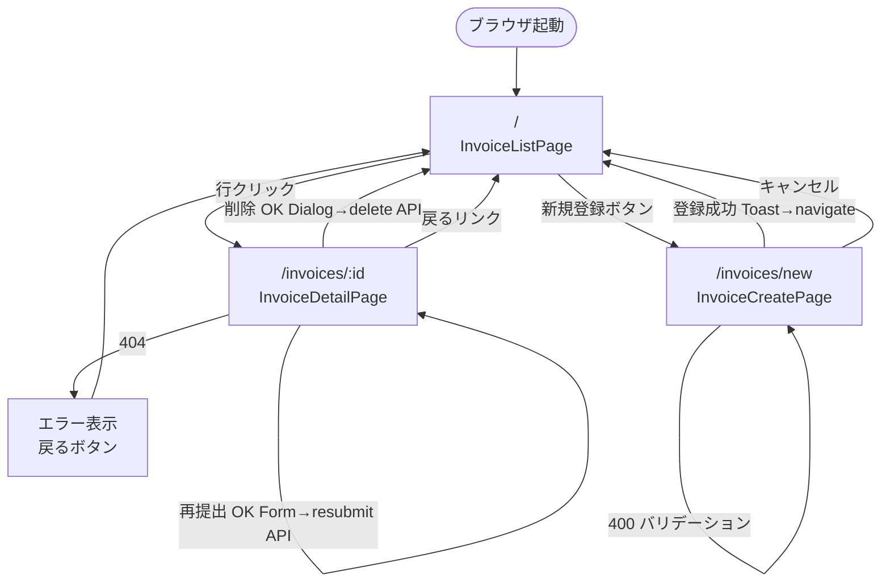

# Functional Design — frontend-ui

**プロジェクト**: 請求書チェック・承認Webシステム
**ユニット**: frontend-ui
**作成日**: 2026-05-04
**ステージ**: Construction - Functional Design
**前提**: React 18 (関数コンポーネント) / Vite / TypeScript (strict) / React Router v6 / Tailwind CSS / Zod / Vitest + React Testing Library

---

## 1. 画面遷移図

3ページ構成 (一覧 / 登録 / 詳細) を React Router v6 の `useNavigate` で遷移する。詳細画面では同一URLのまま差戻し・削除・再提出のダイアログを開く。



### 1.1 ルーティング定義

```tsx
// src/App.tsx
<BrowserRouter>
  <AppShell>
    <Routes>
      <Route path="/" element={<InvoiceListPage />} />
      <Route path="/invoices/new" element={<InvoiceCreatePage />} />
      <Route path="/invoices/:id" element={<InvoiceDetailPage />} />
      <Route path="*" element={<NotFoundPage />} />
    </Routes>
  </AppShell>
</BrowserRouter>
```

`AppShell` はヘッダー (タイトル + Actor/Approver 切替UI)、`<main>` 要素、`<Toaster />` (Toast コンテナ) を提供する。

---

## 2. 各画面の詳細仕様

### 2.1 InvoiceListPage (`/`)

#### 2.1.1 表示項目 (テーブル列)

| 列 | 内容 | フォーマット |
|---|---|---|
| 請求番号 | `invoice.invoice_number` | テキスト |
| 取引先 | `invoice.vendor_id` | テキスト |
| 請求金額 | `invoice.invoice_amount` | `¥` + `Intl.NumberFormat('ja-JP')` (等幅フォント) |
| 発注金額 | `invoice.purchase_order_amount` | 同上 |
| 期限 | `invoice.due_date` | `YYYY/MM/DD` (`new Date(due_date).toLocaleDateString('ja-JP')`) |
| ステータス | `invoice.status` | `<StatusBadge status={...} />` |
| 登録日時 | `invoice.created_at` | `YYYY/MM/DD HH:mm` |

ヘッダー: `bg-gray-100 text-gray-700 font-semibold uppercase text-xs` (design.md §6.4)。
行: ストライプ (`even:bg-gray-50`)、ホバー `hover:bg-primary-100 cursor-pointer`。

#### 2.1.2 ステータスフィルタ select の挙動

- ラベル: 「ステータス:」
- options: select の `value` は英 enum を保持し、表示テキストは StatusBadge と統一した日本語ラベルを用いる:
  ```tsx
  <select aria-label="ステータス" value={status} onChange={e => setStatus(e.target.value as InvoiceStatus | '')}>
    <option value="">すべて</option>
    <option value="pending">承認待ち</option>
    <option value="mismatch">不一致</option>
    <option value="approved">承認済</option>
    <option value="rejected">差戻し済</option>
  </select>
  ```
- onChange: `setStatus(e.target.value)` → useEffect 依存により再フェッチ
- value が `""` の場合、`apiClient.listInvoices({})` を呼ぶ (status クエリは付与しない)
- フィルタ変更直後はリストを clear してローディングを表示
- 表示テキストは §3.1.2 `STATUS_STYLES.label` と1対1で対応すること (バッジ表記との整合)

#### 2.1.3 行クリックで詳細遷移

- `<tr>` に `role="button" tabIndex={0}` を付与
- `onClick={() => navigate(`/invoices/${invoice.id}`)}`
- `onKeyDown` で Enter/Space を拾って同じ navigate (アクセシビリティ)

#### 2.1.4 新規登録ボタン

- 右上に `<Button variant="primary">+ 新規登録</Button>`
- onClick: `navigate('/invoices/new')`

#### 2.1.5 ローディング状態

- `loading === true` の間は `<div className="text-center text-gray-500 py-8">読み込み中...</div>`
- skeleton rows でも可だが PoC ではテキストのみ
- `aria-busy="true"` を `<table>` に付与

#### 2.1.6 エラー状態

- fetch が AppApiError を throw した場合、`error` state にメッセージを保持
- 表示: `<div role="alert" className="bg-red-50 border border-red-200 text-red-800 p-4 rounded-md">{error}</div>`
- 「再試行」ボタンを併置 (再フェッチ)

#### 2.1.7 空配列表示

- `items.length === 0 && !loading && !error` の場合:
  ```
  該当する請求書がありません。
  [+ 新規登録]
  ```
- `<div className="text-center py-12 text-gray-500">` で囲む

#### 2.1.8 状態管理

```tsx
const [items, setItems] = useState<Invoice[]>([]);
const [total, setTotal] = useState(0);
const [status, setStatus] = useState<InvoiceStatus | ''>('');
const [loading, setLoading] = useState(false);
const [error, setError] = useState<string | null>(null);
```

PoC では offset/limit はデフォルト固定 (limit=50)。ページング UI は付けない (受入基準対象外、件数はフッターに「全 N 件」を表示)。

---

### 2.2 InvoiceCreatePage (`/invoices/new`)

#### 2.2.1 フォームフィールド

| Field | 型 | 入力UI | 必須 |
|---|---|---|---|
| `invoice_number` | string | `<input type="text">` (1-50 char) | ✓ |
| `vendor_id` | string | `<input type="text">` (1-50 char) | ✓ |
| `invoice_amount` | int (JPY ≥0) | `<input type="number" inputMode="numeric" min="0" step="1">` | ✓ |
| `purchase_order_amount` | int (JPY ≥0) | 同上 | ✓ |
| `due_date` | string (YYYY-MM-DD) | `<input type="date">` | ✓ |

ラベル末尾に `<span className="text-red-500">*</span>` を付与。各フィールドは `<FormField />` で構成。

#### 2.2.2 Zod クライアント検証

```ts
import { z } from 'zod';

export const createInvoiceFormSchema = z.object({
  invoice_number: z.string().trim().min(1, '請求番号を入力してください').max(50, '50文字以内で入力してください'),
  vendor_id: z.string().trim().min(1, '取引先IDを入力してください').max(50, '50文字以内で入力してください'),
  invoice_amount: z.coerce.number().int('整数で入力してください').min(0, '0以上の値を入力してください'),
  purchase_order_amount: z.coerce.number().int('整数で入力してください').min(0, '0以上の値を入力してください'),
  due_date: z.string().regex(/^\d{4}-\d{2}-\d{2}$/, '日付形式 (YYYY-MM-DD) で入力してください'),
});
export type CreateInvoiceFormValues = z.infer<typeof createInvoiceFormSchema>;
```

サブミット時に `safeParse()` を呼び、`success === false` ならフィールドごとに `errors[fieldName]` を設定して return。

#### 2.2.3 サブミット時の挙動

```tsx
async function handleSubmit(e: FormEvent) {
  e.preventDefault();
  const parsed = createInvoiceFormSchema.safeParse(formValues);
  if (!parsed.success) {
    setFieldErrors(flattenZodError(parsed.error));
    return;
  }
  setSubmitting(true);
  try {
    await apiClient.createInvoice(parsed.data, getActorId());
    toast.success('請求書を登録しました');
    navigate('/');
  } catch (err) {
    handleServerError(err);
  } finally {
    setSubmitting(false);
  }
}
```

サブミット中は Submit ボタンを `disabled` に切替 (Button variant=disabled) し、テキスト「登録中…」表示。

#### 2.2.4 成功時 (Toast → 一覧)

- `toast.success('請求書を登録しました')` を 3秒 表示
- 即座に `navigate('/', { replace: false })`
- 一覧画面はマウント時の useEffect で再フェッチされる (登録直後の請求書がリストに含まれる)

#### 2.2.5 サーバエラー時

| HTTP | 表示 | 場所 |
|---|---|---|
| 400 | フィールド固有のエラーメッセージ。`/invoice_number/`、`/vendor_id/` といったキーワードでメッセージを判定し、対応 FormField の error に設定。判定不可の場合は Toast (error) | FormField + Toast |
| 409 | `<div className="bg-red-50 border border-red-200 text-red-800 p-3 rounded-md mb-4">「同一の取引先と請求番号の組み合わせは既に登録されています」</div>` をフォーム上部に表示 | フォーム上部 |
| 5xx / その他 | `toast.error('登録に失敗しました: ' + err.message)` | Toast |

`AppApiError` には `httpStatus` と `message` が含まれる (§4 参照)。

#### 2.2.6 キャンセルボタン

- `<Button variant="ghost" onClick={() => navigate(-1)}>キャンセル</Button>`
- フォームに変更があっても確認ダイアログは出さない (PoC)

---

### 2.3 InvoiceDetailPage (`/invoices/:id`)

#### 2.3.1 表示項目

| 項目 | 表示 |
|---|---|
| ヘッダー | 「請求書詳細」+ `<StatusBadge status={...} />` |
| ID | `id` (Caption / Mono) |
| 請求番号 | `invoice_number` |
| 取引先ID | `vendor_id` |
| 請求金額 | `¥` + `invoice_amount` (Mono) |
| 発注金額 | `¥` + `purchase_order_amount` (Mono) |
| 金額差額 | `mismatch` の場合のみ赤字で `差額: ¥xxx` |
| 支払期限 | `due_date` |
| 登録日時 | `created_at` |
| 更新日時 | `updated_at` |
| 承認者 | `approver_id` (approved 時のみ) |
| 承認日時 | `approved_at` (approved 時のみ) |
| 差戻し理由 | `rejection_reason` (rejected 時のみ、`<blockquote>` 風) |
| 差戻し者 | `rejected_by` (rejected 時のみ) |
| 差戻し日時 | `rejected_at` (rejected 時のみ) |

「← 一覧へ戻る」リンクを左上に配置 (`<Link to="/">`)。

#### 2.3.2 ステータスに応じたアクションボタン

| status | 表示するボタン |
|---|---|
| `pending` | `[承認]` (primary) ・ `[差戻し]` (danger) ・ `[削除]` (danger, ghost寄り、右端) |
| `mismatch` | `[差戻し]` (danger) ・ `[削除]` (danger 右端) (承認は disabled で表示し「mismatch のため承認できません」をtooltipで表示する案もあるが、PoCでは非表示) |
| `rejected` | `[編集して再提出]` (primary) ・ `[削除]` (danger 右端) |
| `approved` | アクションボタンなし (情報表示のみ)、`「承認済の請求書は変更できません」`を caption 表示 |

ボタンレイアウト: `<div className="flex gap-2 justify-between">`。左グループにアクションボタン、右に削除ボタン。

#### 2.3.3 承認ボタン

- onClick で確認ダイアログ無し (PoC、ワンクリック承認)
- `apiClient.approveInvoice(id, getApproverId())` を呼ぶ
- 成功時: `toast.success('承認しました')` → 詳細画面の invoice を再フェッチ
- エラー時の表示は **§7.2.2 画面別エラー表示テーブルが正の真実**。要約:
  - 400 (Approver-Id 欠落): `toast.error('承認者IDが設定されていません。ヘッダー右上から設定してください。')` (専用ハンドリング、B-01 で確定)
  - 404: `toast.error('対象の請求書が見つかりません')`
  - 409: `toast.error(err.serverMessage)`
  - 422 (mismatch): `toast.error('mismatch のため承認できません')` (固定文言)
  - 上記以外: `handleServerError(err, 'approve')` で汎用フォールバック

#### 2.3.4 差戻しダイアログ

トリガ: `[差戻し]` ボタンクリック → ConfirmDialog 表示。

```
┌─────────────────────────────┐
│ 請求書を差戻しますか?         │
│                             │
│ 差戻し理由 *                 │
│ [textarea (1-500字)        ] │
│                             │
│      [キャンセル] [差戻す]   │
└─────────────────────────────┘
```

- 差戻し理由 textarea (`rows={4}`、`maxLength=500`)、空文字 / 全空白で submit ボタンを disable
- Zod クライアント検証: `z.string().trim().min(1).max(500)`
- submit 時: `apiClient.rejectInvoice(id, { rejection_reason }, getActorId())`
- 成功: `toast.success('差戻しました')`、ダイアログ閉じ、invoice 再フェッチ
- 409 (approved/rejected 状態への差戻し試行): `toast.error('既に承認済 / 差戻済のため差戻しできません')`、ダイアログは閉じる
- それ以外の HTTP ステータスの挙動は §7.2.2 画面別エラー表示テーブルに従う (source of truth)

#### 2.3.5 再提出フォーム

`rejected` ステータスのときのみ `[編集して再提出]` ボタンを表示。
クリックで詳細画面下部の Inline フォームを展開する (別画面遷移はしない)。

| Field | 編集可 |
|---|---|
| `invoice_amount` | ✓ |
| `purchase_order_amount` | ✓ |
| `due_date` | ✓ |
| `invoice_number` | ✗ (read-only) |
| `vendor_id` | ✗ (read-only) |

最低1フィールドは元の値から変更されている必要がある。
初期値は現状値、submit 時に diff を取り、変更があったフィールドのみ payload に含める。

```ts
const payload: ResubmitPayload = {};
if (formValues.invoice_amount !== invoice.invoice_amount) payload.invoice_amount = formValues.invoice_amount;
if (formValues.purchase_order_amount !== invoice.purchase_order_amount) payload.purchase_order_amount = formValues.purchase_order_amount;
if (formValues.due_date !== invoice.due_date) payload.due_date = formValues.due_date;

if (Object.keys(payload).length === 0) {
  setFormError('少なくとも1つのフィールドを変更してください');
  return;
}
await apiClient.resubmitInvoice(id, payload, getActorId());
```

成功時: `toast.success('再提出しました')`、フォームを閉じ、invoice 再フェッチ。
ステータスは backend 側の判定により `pending` または `mismatch` に変わる。

#### 2.3.6 削除確認ダイアログ

トリガ: `[削除]` ボタンクリック → ConfirmDialog 表示。

```
┌─────────────────────────────┐
│ 請求書を削除しますか?         │
│                             │
│ この操作は取り消せません。     │
│ 確認のため「削除」と入力して   │
│ ください。                   │
│ [削除                      ] │
│                             │
│      [キャンセル]   [削除]   │
└─────────────────────────────┘
```

- 確認テキスト入力 (`requireConfirmText: '削除'`) が一致するまで「削除」ボタンを disable
- onConfirm: `apiClient.deleteInvoice(id, getActorId())`
- 成功: `toast.success('削除しました')` → `navigate('/')`
- **409 (approved): `toast.error('承認済の請求書は削除できません')`、ダイアログは閉じる** (B-01 で確定した固定文言、テスト D-14 と一致させる)
- 上記以外の HTTP ステータスの挙動は §7.2.2 画面別エラー表示テーブルに従う (source of truth)

#### 2.3.7 ローディング / エラー / Not Found

- マウント時 `apiClient.getInvoice(id)` 呼び出し中は `loading=true`
- **404 の場合 (B-01 で確定)**: 画面内に `<div role="alert">請求書が見つかりません</div>` + `[一覧へ戻る]` ボタンを表示する。**Toast は出さない** (詳細画面のレイアウト保全のため)。詳細表示エリアは丸ごとこのフルページエラーで置換する。
- その他エラー: 一覧と同じパターンで再試行ボタン付き
- §7.2.2 のテーブルが正の真実であり、本節の挙動はそれに準拠する

---

## 3. 共通UIコンポーネント仕様

すべて `src/components/` 配下、関数コンポーネント、TypeScript strict、`forwardRef` は不要 (PoC)。

### 3.1 StatusBadge

#### 3.1.1 Props

```ts
type StatusBadgeProps = {
  status: 'pending' | 'approved' | 'rejected' | 'mismatch';
  className?: string;
};
```

#### 3.1.2 Tailwind クラス (design.md §6.2 準拠)

ラベルは全て日本語表記に統一する (B-02 解消)。配色は **Tailwind 標準パレットを使用** する方針とし、`tailwind.config.js` 側の `colors.status.*` カスタムトークンは用いない (I-05; ID §7.1 のカスタムトークン定義は削除する。後述 ID 側の修正と整合)。

```ts
const STATUS_STYLES: Record<InvoiceStatus, { bg: string; text: string; label: string }> = {
  pending:  { bg: 'bg-amber-100',   text: 'text-amber-800',   label: '承認待ち' },
  approved: { bg: 'bg-emerald-100', text: 'text-emerald-800', label: '承認済'   },
  rejected: { bg: 'bg-gray-200',    text: 'text-gray-700',    label: '差戻し済' },
  mismatch: { bg: 'bg-red-100',     text: 'text-red-800',     label: '不一致'   },
};
```

#### 3.1.3 マークアップ

```tsx
<span
  className={clsx(
    'inline-flex items-center px-2 py-0.5 rounded-md text-xs font-medium',
    STATUS_STYLES[status].bg,
    STATUS_STYLES[status].text,
    className,
  )}
  aria-label={`ステータス: ${STATUS_STYLES[status].label}`}
>
  {STATUS_STYLES[status].label}
</span>
```

### 3.2 Button

#### 3.2.1 Props

```ts
type ButtonProps = {
  variant?: 'primary' | 'secondary' | 'danger' | 'ghost' | 'disabled';
  type?: 'button' | 'submit' | 'reset';
  disabled?: boolean;
  onClick?: (e: React.MouseEvent<HTMLButtonElement>) => void;
  children: React.ReactNode;
  className?: string;
  'aria-label'?: string;
};
```

#### 3.2.2 Tailwind クラスマッピング (design.md §6.1 準拠)

```ts
const VARIANT_CLASSES: Record<NonNullable<ButtonProps['variant']>, string> = {
  primary:   'bg-primary-700 hover:bg-primary-900 text-white',
  secondary: 'bg-white hover:bg-gray-100 text-primary-700 border border-primary-700',
  danger:    'bg-red-600 hover:bg-red-700 text-white',
  ghost:     'bg-transparent hover:bg-gray-100 text-gray-700',
  disabled:  'bg-gray-200 text-gray-500 cursor-not-allowed',
};

const BASE = 'px-4 py-2 rounded-md font-medium text-sm transition-colors duration-200 focus:outline-none focus:ring-2 focus:ring-primary-500 focus:ring-offset-2 disabled:bg-gray-200 disabled:text-gray-500 disabled:cursor-not-allowed';
```

`disabled` prop が true の場合、自動的に `disabled` variant のクラスを優先適用。

### 3.3 FormField

#### 3.3.1 Props

```ts
type FormFieldProps = {
  id: string;            // input id (label for と紐づけ)
  label: string;
  required?: boolean;
  error?: string | null;
  helpText?: string;
  children: React.ReactElement; // input / textarea / select。aria-* 属性を注入する
};
```

#### 3.3.2 構造

```tsx
<div className="mb-4">
  <label htmlFor={id} className="block text-sm font-medium text-gray-700 mb-2">
    {label}
    {required && <span className="text-red-500" aria-hidden="true">*</span>}
  </label>
  {React.cloneElement(children, {
    id,
    'aria-required': required,
    'aria-invalid': !!error,
    'aria-describedby': error ? `${id}-error` : helpText ? `${id}-help` : undefined,
  })}
  {helpText && !error && (
    <p id={`${id}-help`} className="mt-1 text-xs text-gray-500">{helpText}</p>
  )}
  {error && (
    <p id={`${id}-error`} role="alert" className="mt-1 text-xs text-red-600">{error}</p>
  )}
</div>
```

入力要素には呼び出し側で標準クラスを付与する: `block w-full rounded-md border border-gray-300 px-3 py-2 text-sm focus:ring-2 focus:ring-primary-500 focus:border-primary-500`。エラー時は `border-red-500`。

### 3.4 Toast

#### 3.4.1 API

シングルトン Toast Manager + Provider 構成。

```ts
// src/components/Toast.tsx
type ToastVariant = 'success' | 'error' | 'warning';
type ToastItem = { id: string; variant: ToastVariant; message: string };

export const toast = {
  success: (message: string) => emit('success', message),
  error:   (message: string) => emit('error', message),
  warning: (message: string) => emit('warning', message),
};

export function Toaster(): JSX.Element { /* portal で右上に固定表示 */ }
```

`emit()` は EventTarget もしくは独自 store に push。`<Toaster />` 内で `useEffect` により subscribe、新規 toast を 3秒後に自動消去。

#### 3.4.2 表示クラス (design.md §2.3 準拠)

配色方針は §3.1.2 と同じく **Tailwind 標準パレットを使用** する (I-05 / I-06 統一方針)。`bg-amber-50` は design.md §2.3 の `--color-warning-bg = #FFFBEB` と等価のため意味的整合は保たれる。ID §7.1 の `successBg` / `errorBg` / `warningBg` カスタムトークンは未使用となるため削除する (ID 側で対応)。

| variant | 背景 | テキスト | アイコン | role / aria-live |
|---|---|---|---|---|
| success | `bg-emerald-50 border-emerald-200` | `text-emerald-800` | check | `role="status"` / `aria-live="polite"` |
| error | `bg-red-50 border-red-200` | `text-red-800` | x-circle | `role="alert"` / `aria-live="assertive"` (I-02) |
| warning | `bg-amber-50 border-amber-200` | `text-amber-800` | exclamation | `role="status"` / `aria-live="polite"` |

```tsx
<div role="status" aria-live="polite"
  className="fixed top-4 right-4 z-50 space-y-2">
  {items.map(t => (
    <div key={t.id}
      className={clsx('px-4 py-3 rounded-md border shadow-md max-w-sm', variantClass(t.variant))}>
      {t.message}
    </div>
  ))}
</div>
```

3秒後の自動消去は `setTimeout(() => remove(id), 3000)`。

### 3.5 ConfirmDialog

#### 3.5.1 Props

```ts
type ConfirmDialogProps = {
  open: boolean;
  title: string;
  body?: React.ReactNode;
  requireConfirmText?: string;       // 入力一致を要求する場合
  confirmLabel?: string;              // default: 'OK'
  cancelLabel?: string;               // default: 'キャンセル'
  confirmVariant?: 'primary' | 'danger';
  onConfirm: () => void | Promise<void>;
  onCancel: () => void;
  loading?: boolean;                  // confirm 中の disabled 制御
};
```

#### 3.5.2 構造 (design.md §6.6 準拠)

```tsx
{open && (
  <div role="dialog" aria-modal="true" aria-labelledby="dlg-title"
       className="fixed inset-0 z-40 flex items-center justify-center">
    {/* オーバーレイ */}
    <div className="absolute inset-0 bg-black/50" onClick={onCancel} />
    {/* ダイアログ本体 */}
    <div className="relative bg-white rounded-lg shadow-lg p-6 max-w-md w-full mx-4">
      <h2 id="dlg-title" className="text-lg font-semibold text-gray-900 mb-4">{title}</h2>
      {body && <div className="text-sm text-gray-700 mb-4">{body}</div>}
      {requireConfirmText && (
        <FormField id="confirm-text" label={`確認のため「${requireConfirmText}」と入力してください`} required>
          <input type="text" value={confirmInput} onChange={e => setConfirmInput(e.target.value)}
                 className="block w-full rounded-md border border-gray-300 px-3 py-2 text-sm" />
        </FormField>
      )}
      <div className="flex gap-2 justify-end mt-6">
        <Button variant="ghost" onClick={onCancel} disabled={loading}>{cancelLabel ?? 'キャンセル'}</Button>
        <Button variant={confirmVariant ?? 'primary'}
                disabled={loading || (requireConfirmText && confirmInput !== requireConfirmText)}
                onClick={onConfirm}>
          {confirmLabel ?? 'OK'}
        </Button>
      </div>
    </div>
  </div>
)}
```

#### 3.5.3 ESC / オーバーレイクリック / フォーカストラップ

- `useEffect` で `keydown` リスナを追加し、`Escape` キーで `onCancel()` を呼ぶ
- オーバーレイ要素の `onClick` で `onCancel()` を呼ぶ
- ダイアログ本体は `onClick={e => e.stopPropagation()}` でバブリングを止める
- 開いている間 `document.body.style.overflow = 'hidden'`、閉じる時に解除
- **フォーカストラップ (最低限実装、I-04 反映)**:
  - ダイアログ open 時にダイアログ内の最初のフォーカス可能要素 (input または最初のボタン) に自動フォーカスする
  - ダイアログ open 中の `keydown` で `Tab` を検知し、以下の循環を実装する:
    - **最後のフォーカス可能要素で Tab を押した場合 → 最初の要素にフォーカスを戻す** (`event.preventDefault()` 後 `firstEl.focus()`)
    - **最初のフォーカス可能要素で Shift+Tab を押した場合 → 最後の要素にフォーカスを移す** (同様に prevent + `lastEl.focus()`)
  - フォーカス可能要素の収集は `dialogRef.current.querySelectorAll('input, button, [tabindex]:not([tabindex="-1"])')` で行い、`disabled` / `hidden` を除外する
  - これにより design.md §9 「モーダルは ESC で閉じる、Tab フォーカストラップ」要請を満たす

---

## 4. apiClient 詳細仕様

ファイル: `src/api/apiClient.ts`

### 4.1 関数シグネチャ (TypeScript)

```ts
import type {
  Invoice, InvoiceStatus, CreateInvoicePayload, ResubmitPayload,
  ListInvoicesResponse,
} from '../types';

export class AppApiError extends Error {
  constructor(
    public readonly httpStatus: number,
    public readonly serverMessage: string,
  ) {
    super(serverMessage);
    this.name = 'AppApiError';
  }
}

export const apiClient = {
  listInvoices(params?: { status?: InvoiceStatus; limit?: number; offset?: number }): Promise<ListInvoicesResponse>;
  getInvoice(id: string): Promise<Invoice>;
  createInvoice(payload: CreateInvoicePayload, actorId: string): Promise<Invoice>;
  approveInvoice(id: string, approverId: string): Promise<Invoice>;
  rejectInvoice(id: string, payload: { rejection_reason: string }, actorId: string): Promise<Invoice>;
  resubmitInvoice(id: string, payload: ResubmitPayload, actorId: string): Promise<Invoice>;
  deleteInvoice(id: string, actorId: string): Promise<void>;
};
```

### 4.2 fetch ラップ実装

```ts
const BASE_URL = import.meta.env.VITE_API_BASE_URL ?? 'http://localhost:3000';

type RequestOptions = {
  method?: 'GET' | 'POST' | 'PATCH' | 'DELETE';
  body?: unknown;
  query?: Record<string, string | number | undefined>;
  actorId?: string;     // X-Actor-Id (承認以外で必要)
  approverId?: string;  // X-Approver-Id (承認のみ)
};

async function request<T>(path: string, opts: RequestOptions = {}): Promise<T> {
  const url = new URL(path, BASE_URL);
  if (opts.query) {
    for (const [k, v] of Object.entries(opts.query)) {
      if (v !== undefined && v !== '') url.searchParams.set(k, String(v));
    }
  }

  const headers: Record<string, string> = {};
  if (opts.body !== undefined) headers['Content-Type'] = 'application/json';
  if (opts.actorId) headers['X-Actor-Id'] = opts.actorId;
  if (opts.approverId) headers['X-Approver-Id'] = opts.approverId;

  const res = await fetch(url.toString(), {
    method: opts.method ?? 'GET',
    headers,
    body: opts.body !== undefined ? JSON.stringify(opts.body) : undefined,
  });

  if (!res.ok) {
    let serverMessage = `HTTP ${res.status}`;
    try {
      const json = (await res.json()) as { error?: string };
      if (json && typeof json.error === 'string') serverMessage = json.error;
    } catch { /* JSON でない場合は HTTP ステータスのみ */ }
    throw new AppApiError(res.status, serverMessage);
  }

  if (res.status === 204) return undefined as T;
  return (await res.json()) as T;
}
```

### 4.3 各関数の実装例

```ts
export const apiClient = {
  listInvoices: (params) =>
    request<ListInvoicesResponse>('/api/invoices', { query: params }),

  getInvoice: (id) =>
    request<Invoice>(`/api/invoices/${encodeURIComponent(id)}`),

  createInvoice: (payload, actorId) =>
    request<Invoice>('/api/invoices', { method: 'POST', body: payload, actorId }),

  approveInvoice: (id, approverId) =>
    request<Invoice>(`/api/invoices/${encodeURIComponent(id)}/approve`, { method: 'POST', body: {}, approverId }),

  rejectInvoice: (id, payload, actorId) =>
    request<Invoice>(`/api/invoices/${encodeURIComponent(id)}/reject`, { method: 'POST', body: payload, actorId }),

  resubmitInvoice: (id, payload, actorId) =>
    request<Invoice>(`/api/invoices/${encodeURIComponent(id)}/resubmit`, { method: 'PATCH', body: payload, actorId }),

  deleteInvoice: (id, actorId) =>
    request<void>(`/api/invoices/${encodeURIComponent(id)}`, { method: 'DELETE', actorId }),
};
```

### 4.4 X-Actor-Id 自動付与の方針

- apiClient 自体は `actorId` / `approverId` を**引数で受け取る**設計
- localStorage からの取得は呼び出し側 (`getActorId()`, `getApproverId()` ヘルパ) で行う (テスト容易性、依存方向の明示)
- `getActorId()` が空文字を返した場合は呼び出し側で警告 Toast を出すか、サブミットを止める

### 4.5 エラーハンドリング契約

- 2xx 以外はすべて `AppApiError` を throw
- `AppApiError.httpStatus` と `serverMessage` を呼び出し側で使い分け
- ネットワークエラー (`fetch` が reject する場合) は素の `TypeError` がそのまま伝播 → 呼び出し側で catch して `toast.error('ネットワークエラー')` 表示

---

## 5. Actor / Approver ID 管理

### 5.1 localStorage キー

| キー | 用途 |
|---|---|
| `actorId` | `X-Actor-Id` 用 (登録/差戻/再提出/削除) |
| `approverId` | `X-Approver-Id` 用 (承認) |

### 5.2 ヘルパ関数 (`src/lib/actor.ts`)

```ts
const ACTOR_KEY = 'actorId';
const APPROVER_KEY = 'approverId';

export function getActorId(): string {
  return localStorage.getItem(ACTOR_KEY) ?? '';
}
export function setActorId(value: string): void {
  localStorage.setItem(ACTOR_KEY, value);
}
export function getApproverId(): string {
  return localStorage.getItem(APPROVER_KEY) ?? '';
}
export function setApproverId(value: string): void {
  localStorage.setItem(APPROVER_KEY, value);
}
```

形式バリデーション (1-50 chars, 英数字/-/_): クライアント側でも `/^[A-Za-z0-9_-]{1,50}$/` を確認。違反時は保存せず、入力欄下部にエラー表示。

### 5.3 ヘッダー切替UI

`AppShell` のヘッダー右側に2つのテキスト入力 (display only popover でも可) を配置:

```
┌──────────────────────────────────────────────┐
│ 請求書システム      Actor: [user-001    ✓]    │
│                    Approver: [approver-01 ✓] │
└──────────────────────────────────────────────┘
```

- フォーカス outside または「保存」ボタンで `setActorId` / `setApproverId` を呼ぶ
- 入力中は内部 state、保存ボタン押下で localStorage 反映 + Toast (success: 'IDを更新しました')
- 初回起動時 (`getActorId() === ''`) は控えめなバナーで「Actor IDが未設定です」と注意喚起 (PoC、ブロックはしない)

---

## 6. Type 定義 (frontend 個別)

ファイル: `src/types/index.ts`

```ts
export type InvoiceStatus = 'pending' | 'approved' | 'rejected' | 'mismatch';

export type Invoice = {
  id: string;
  invoice_number: string;
  vendor_id: string;
  invoice_amount: number;
  purchase_order_amount: number;
  due_date: string;            // YYYY-MM-DD
  status: InvoiceStatus;
  approver_id: string | null;
  approved_at: string | null;  // ISO 8601 UTC
  rejection_reason: string | null;
  rejected_by: string | null;
  rejected_at: string | null;
  created_at: string;
  updated_at: string;
};

export type CreateInvoicePayload = {
  invoice_number: string;
  vendor_id: string;
  invoice_amount: number;
  purchase_order_amount: number;
  due_date: string;
};

export type ResubmitPayload = {
  invoice_amount?: number;
  purchase_order_amount?: number;
  due_date?: string;
};

export type ListInvoicesResponse = {
  items: Invoice[];
  total: number;
};

export type AuditAction = 'create' | 'approve' | 'reject' | 'resubmit' | 'delete';

export type AuditLog = {
  id: string;
  action: AuditAction;
  actor_id: string;
  invoice_id: string;
  before_status: InvoiceStatus | null;
  after_status: InvoiceStatus | null;
  note: string | null;
  created_at: string;
};
```

**共有しない方針** (application-design.md §7、unit-of-work.md §2.1):
backend の Prisma モデルや Zod スキーマは frontend で参照しない。API契約 (`api-contract.md`) を信頼し型を個別定義する。型のずれは Vitest の契約テスト (将来) で検出する想定。

---

## 7. エラー表示戦略

### 7.1 フォームバリデーション (Zod クライアント)

- Zod の `safeParse()` の `error.flatten().fieldErrors` を `Record<string, string[]>` として保持
- 各 FormField の `error` props に `fieldErrors[name]?.[0]` を渡す
- 表示クラス: `mt-1 text-xs text-red-600` (design.md §6.5)
- `aria-invalid="true"`, `aria-describedby="<field>-error"` を付与
- フォーカスは最初のエラーフィールドに移動 (`useEffect` で `document.getElementById(firstErrorId)?.focus()`)

### 7.2 サーバーエラーマッピング

#### 7.2.1 設計方針 (B-01 解消)

- **画面/操作個別の文言・表示先テーブル (§7.2.2) を「正の真実 (source of truth)」とする**。
- `handleServerError(err, context)` は **「画面個別ハンドリングが該当しなかった場合の汎用フォールバック」** として位置付ける。各ページでは原則として下記テーブルに従う個別実装を行い、network エラーや想定外の HTTP ステータスのみ `handleServerError` に委譲する。
- 各ページの try/catch では概ね次の順序で判定する:
  1. `err instanceof AppApiError` でなければ network 系として `toast.error('ネットワークエラーが発生しました')`
  2. `err.httpStatus` ごとに §7.2.2 の画面別文言で表示
  3. テーブルに該当しないステータスは `handleServerError(err, context)` (汎用フォールバック) に委譲

#### 7.2.2 画面別エラー表示テーブル (source of truth)

| 画面 / 操作 (context) | HTTP | 表示先 | 文言 / 挙動 |
|---|---|---|---|
| 登録 (`create`) | 400 | FormField + 必要なら Toast | サーバの `error` 文言からフィールド推定 (`/invoice_number/` 等)。推定不可なら `toast.warning(err.serverMessage \|\| '入力内容に誤りがあります')` |
| 登録 (`create`) | 409 | フォーム上部 inline banner | 「すでに登録済みです (同じ取引先IDと請求番号の組み合わせ)」 / フィールドはクリアしない |
| 登録 (`create`) | 5xx / その他 | Toast (error) | 「登録に失敗しました: {serverMessage}」 |
| 承認 (`approve`) | 400 (Approver-Id 欠落) | Toast (error) | **専用ハンドリング**: `getApproverId() === ''` の事前チェック、または `err.serverMessage` に Approver-Id 関連語 (`Approver` / `承認者`) を含む場合は `toast.error('承認者IDが設定されていません。ヘッダー右上から設定してください。')` |
| 承認 (`approve`) | 404 | Toast (error) | 「対象の請求書が見つかりません」 |
| 承認 (`approve`) | 409 | Toast (error) | `err.serverMessage` をそのまま表示 (例: 「既に承認済 / 差戻済です」) |
| 承認 (`approve`) | 422 | Toast (error) | 「mismatch のため承認できません」 (固定文言) |
| 差戻し (`reject`) | 400 | フィールドエラー | `rejection_reason` の長さ違反等は textarea 下に inline 表示 |
| 差戻し (`reject`) | 409 | Toast (error) + ダイアログ閉じ | 「既に承認済 / 差戻済のため差戻しできません」 |
| 再提出 (`resubmit`) | 400 | フィールドエラー or Toast | `err.serverMessage` をフィールドエラーに、判定不可なら `toast.warning(...)` |
| 再提出 (`resubmit`) | 409 | Toast (error) | 「rejected 状態の請求書のみ再提出できます」 |
| 削除 (`delete`) | 409 | Toast (error) + ダイアログ閉じ | **「承認済の請求書は削除できません」 (固定文言、B-01 で確定)** |
| 削除 (`delete`) | 404 | Toast (error) + 一覧へ | 「対象の請求書が見つかりません」 |
| 詳細 (`detail` GET) | 404 | **画面内 alert + 「一覧へ戻る」ボタン (Toast は出さない)** | 「請求書が見つかりません」 / 詳細ページのレイアウト保全のため Toast 単独は禁止 (B-01 で確定) |
| 全 context | 上記以外 | Toast (error) | `err.serverMessage` または `HTTP {status}` |

> 上記のうち **承認400 (Approver-Id 欠落)・削除409 文言・詳細404 表示先** は B-01 修正で確定した強い契約事項であり、テストアサーション (D-07 / D-14 / D-15) はこの文言と完全一致でなければならない。

#### 7.2.3 汎用フォールバック実装

```ts
// 画面個別の switch で拾えなかった場合のみ呼ぶ (汎用フォールバック)
function handleServerError(err: unknown, context: 'create' | 'approve' | 'reject' | 'resubmit' | 'delete'): void {
  if (!(err instanceof AppApiError)) {
    toast.error('ネットワークエラーが発生しました');
    return;
  }
  // 画面側の switch でハンドル済みのケースには到達しない想定。
  // ここでは「想定外ステータス」を Toast (error) で素通し表示する。
  toast.error(`エラー: ${err.serverMessage || `HTTP ${err.httpStatus}`}`);
}
```

各ページの実装パターン (例: 詳細画面の承認):

```ts
try {
  await apiClient.approveInvoice(id, getApproverId());
  toast.success('承認しました');
  await refetch();
} catch (err) {
  if (err instanceof AppApiError) {
    if (err.httpStatus === 400 && /Approver|承認者/i.test(err.serverMessage)) {
      toast.error('承認者IDが設定されていません。ヘッダー右上から設定してください。');
      return;
    }
    if (err.httpStatus === 404) { toast.error('対象の請求書が見つかりません'); return; }
    if (err.httpStatus === 409) { toast.error(err.serverMessage); return; }
    if (err.httpStatus === 422) { toast.error('mismatch のため承認できません'); return; }
  }
  handleServerError(err, 'approve'); // フォールバック
}
```

---

## 8. テストケース一覧 (Vitest + React Testing Library)

ファイル配置: `tests/` 配下、各コンポーネント / ページ / モジュールに対応する `*.test.tsx` / `*.test.ts`。
fetch は MSW (Mock Service Worker) または `vi.fn()` の手動モックで stub する。MSW は import コストが PoC レベルで適度なため採用候補。手動モック (`vi.mocked(global.fetch)`) でも可。

### 8.1 InvoiceListPage

| # | ケース | 期待 |
|---|---|---|
| L-01 | マウント時に listInvoices が呼ばれる | `apiClient.listInvoices` が1回 status=undefined で呼ばれる |
| L-02 | 取得結果がテーブルに表示される | invoice_number / vendor_id 等が画面上にレンダリングされる |
| L-03 | ステータス select 変更で再フェッチ | select に 'approved' を入れると `listInvoices({ status: 'approved' })` が呼ばれる |
| L-04 | 行クリックで詳細遷移 | `useNavigate` のモックが `/invoices/<id>` で呼ばれる |
| L-05 | 新規登録ボタンで遷移 | navigate('/invoices/new') |
| L-06 | ローディング中の表示 | 「読み込み中...」が表示される、`aria-busy=true` |
| L-07 | エラー時の alert 表示 | `role="alert"` 要素にメッセージが表示、再試行ボタンが押せる |
| L-08 | 空配列時のメッセージ | 「該当する請求書がありません」+ 新規登録ボタン表示 |

### 8.2 InvoiceCreatePage

| # | ケース | 期待 |
|---|---|---|
| C-01 | 必須欠落で submit | Zod エラーで各フィールドに `mt-1 text-xs text-red-600` のメッセージ表示。createInvoice は呼ばれない |
| C-02 | invoice_amount に文字を入力 | 「整数で入力してください」エラー |
| C-03 | invoice_amount に -1 を入力 | 「0以上の値を入力してください」エラー |
| C-04 | due_date 形式不正 | 「日付形式 (YYYY-MM-DD) で入力してください」エラー |
| C-05 | 正常 submit | createInvoice が呼ばれ、Toast 'success' が出て `navigate('/')` |
| C-06 | 409 重複 | フォーム上部に「すでに登録済みです」inline banner、フィールドはクリアされない |
| C-07 | 400 サーバ | toast.warning が呼ばれる |
| C-08 | 5xx | toast.error が呼ばれる |
| C-09 | サブミット中はボタン disabled | ボタンに `disabled` 属性、テキスト「登録中…」 |

### 8.3 InvoiceDetailPage

| # | ケース | 期待 |
|---|---|---|
| D-01 | id でフェッチ → 表示 | `apiClient.getInvoice('inv-1')` 呼ばれ、各項目が画面に出る |
| D-02 | pending 時のボタン構成 | 承認 / 差戻 / 削除ボタンが render される、再提出ボタンは無い |
| D-03 | mismatch 時のボタン構成 | 差戻 / 削除のみ、承認ボタンは無い |
| D-04 | rejected 時 | 編集して再提出 / 削除 |
| D-05 | approved 時 | アクションボタン無し、Caption 表示 |
| D-06 | 承認クリック → API → 再フェッチ | approveInvoice 呼ばれる、toast.success、getInvoice 再呼び出し |
| D-07 | 422 (mismatch 承認試行) | toast.error('mismatch のため承認できません') |
| D-08 | 差戻ダイアログ表示 | ConfirmDialog open=true、textarea が空のとき差戻ボタン disabled |
| D-09 | 差戻 submit | rejectInvoice 呼ばれる、Toast、再フェッチ |
| D-10 | 再提出フォームに変更なし submit | 「少なくとも1つのフィールドを変更してください」エラー、API 呼ばれない |
| D-11 | 再提出 submit (金額変更) | resubmitInvoice が `{ invoice_amount: ... }` のみ含む payload で呼ばれる |
| D-12 | 削除ダイアログで確認テキスト不一致 | OK ボタン disabled |
| D-13 | 削除成功 → 一覧へ | deleteInvoice 呼ばれ、toast、navigate('/') |
| D-14 | 削除 409 (approved 試行) | toast.error 表示、ダイアログ閉じ |
| D-15 | 404 で表示 | 「請求書が見つかりません」表示、一覧へ戻るリンク |

### 8.4 共通UIコンポーネント

| # | ケース | 期待 |
|---|---|---|
| SB-01 | StatusBadge: pending | `bg-amber-100 text-amber-800` クラス、ラベル「承認待ち」 |
| SB-02 | StatusBadge: approved | `bg-emerald-100 text-emerald-800`、「承認済」 |
| SB-03 | StatusBadge: rejected | `bg-gray-200 text-gray-700`、「差戻し済」 |
| SB-04 | StatusBadge: mismatch | `bg-red-100 text-red-800`、「不一致」 |
| BT-01 | Button: primary クラス検証 | `bg-primary-700` クラス含む |
| BT-02 | Button: disabled true で onClick 呼ばれない | クリックしても callback 未実行 |
| BT-03 | Button: variant=disabled で `cursor-not-allowed` | 該当クラス含む |
| FF-01 | FormField: required で `*` 表示 | `*` 文字、`aria-required=true` |
| FF-02 | FormField: error 表示 | `role="alert"` 要素、`aria-invalid=true`、`aria-describedby` 設定 |
| TS-01 | Toast: success 表示 → 3秒で消える | 表示確認後、3秒進めて非表示確認 (`vi.useFakeTimers()`) |
| TS-02 | Toast: 並列に複数 | 2つ並ぶこと |
| CD-01 | ConfirmDialog: ESC で onCancel 呼ばれる | keydown Escape で onCancel が1回呼ばれる |
| CD-02 | ConfirmDialog: オーバーレイクリック | onCancel が呼ばれる |
| CD-03 | ConfirmDialog: ダイアログ内クリックでは閉じない | onCancel 呼ばれない |
| CD-04 | ConfirmDialog: requireConfirmText 不一致で OK disabled | OK ボタンに disabled |
| CD-05 | ConfirmDialog: 一致で OK enabled、クリックで onConfirm | onConfirm 1回呼ばれる |

### 8.5 apiClient

| # | ケース | 期待 |
|---|---|---|
| API-01 | listInvoices: GET /api/invoices?status=pending | URL とメソッド検証、レスポンス JSON 返却 |
| API-02 | createInvoice: POST + Content-Type + X-Actor-Id ヘッダ | ヘッダ確認 |
| API-03 | approveInvoice: X-Approver-Id ヘッダ、X-Actor-Id 無し | ヘッダ確認 |
| API-04 | 4xx で AppApiError throw | `httpStatus` と `serverMessage` が JSON `error` 由来 |
| API-05 | 4xx で JSON でない応答 | `serverMessage === 'HTTP {status}'` |
| API-06 | 204 (delete) | undefined を返す、JSON parse は呼ばれない |
| API-07 | VITE_API_BASE_URL が設定されている場合 | URL の origin がそれに従う |
| API-08 | VITE_API_BASE_URL 未設定 | `http://localhost:3000` がデフォルト |

### 8.6 actor.ts ヘルパ

| # | ケース | 期待 |
|---|---|---|
| AC-01 | getActorId 未設定で空文字 | `''` 返却 |
| AC-02 | setActorId 後に getActorId | 設定値が返る |
| AC-03 | getApproverId / setApproverId | 同上 |

### 8.7 テスト共通設定

- `vitest.config.ts`: `environment: 'jsdom'`, `setupFiles: ['./tests/setup.ts']`
- `tests/setup.ts`: `@testing-library/jest-dom` の matchers 拡張、`localStorage` のクリア (`beforeEach`)
- `vi.mock('react-router-dom', ...)` で `useNavigate` / `useParams` をテスト毎に注入
- **カバレッジ閾値 (I-10 反映)**: PoC でも受入基準 §10 「正常系・異常系のユニットテストが全て成功」を客観判定するため最低限の閾値を設定する。`vitest.config.ts` に下記を追加し、`npm test` (= `vitest run`) 実行時に CI で強制する:
  ```ts
  // vitest.config.ts (抜粋)
  export default defineConfig({
    test: {
      environment: 'jsdom',
      setupFiles: ['./tests/setup.ts'],
      coverage: {
        provider: 'v8',
        reporter: ['text', 'html'],
        include: ['src/**/*.{ts,tsx}'],
        exclude: ['src/main.tsx', 'src/**/*.d.ts'],
        thresholds: {
          statements: 70,
          branches: 60,
        },
      },
    },
  });
  ```
- カバレッジ計測は `npm test -- --coverage` で実行。閾値割れ時は CI が失敗する
- カバレッジ対象: pages / components / api / lib のすべて

---

## 9. 補足: 環境変数

| 変数 | 用途 | デフォルト |
|---|---|---|
| `VITE_API_BASE_URL` | apiClient の Backend ベースURL | `http://localhost:3000` |

`vite.config.ts` で `define` するか `.env` で管理し、`import.meta.env.VITE_API_BASE_URL` で参照。

---

## 修正履歴
- 2026-05-04 R1 → R2: B-01/B-02 解消、I-04/I-05/I-06/I-10 反映
  - B-01: §7.2 を「画面別エラー表示テーブルが正の真実 / `handleServerError` は汎用フォールバック」に再定義。詳細404 は画面内 alert 確定 (Toast 出さず)、削除409 は「承認済の請求書は削除できません」固定、承認400 (Approver-Id 欠落) は専用ハンドリング維持。§2.3.3 / §2.3.4 / §2.3.6 / §2.3.7 を §7.2.2 への参照付きに統一。
  - B-02: §3.1.2 `STATUS_STYLES.label` の `pending` を 'Pending' → '承認待ち' に変更し、4ステータスとも日本語に統一。§2.1.2 ステータスフィルタ select の表示テキストもバッジと同じ日本語ラベルに統一 (`value` は英 enum を保持)。テストケース SB-01 の期待値も更新。
  - I-04: §3.5.3 「Tab ループは省略可」の記述を削除し、最低限のフォーカストラップ実装 (Tab 循環 / Shift+Tab 逆方向) を明記。
  - I-05: §3.1.2 配色方針として Tailwind 標準パレット使用を明記し、ID §7.1 のカスタム `colors.status.*` トークンは削除する旨を併記。
  - I-06: §3.4.2 Toast の warning 配色も同方針 (標準パレット `bg-amber-50` 維持、ID §7.1 の `successBg`/`errorBg`/`warningBg` トークン削除) を明記。あわせて Toast の `role` を variant 別に記載 (I-02 軽微反映)。
  - I-10: §8.7 を「PoC でも最低限の閾値を設定する」と変更し、`vitest.config.ts` の `coverage.thresholds` に `statements: 70, branches: 60` を追加することを明記。
