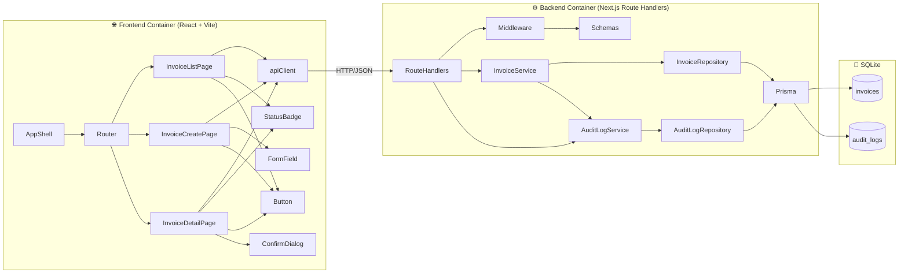

# Component Dependency

**プロジェクト**: 請求書チェック・承認Webシステム
**作成日**: 2026-05-04

---

## 1. 全体依存関係図 (Mermaid)



---

## 2. 依存マトリクス (バックエンド)

| ↓依存元 / 依存先→ | RouteHandler | InvoiceService | AuditLogService | InvoiceRepo | AuditLogRepo | Prisma | Schemas | Middleware |
|---|---|---|---|---|---|---|---|---|
| RouteHandler | - | ✓ | ✓ | - | - | - | ✓ | ✓ |
| InvoiceService | - | - | ✓ | ✓ | - | ✓ (tx) | - | - |
| AuditLogService | - | - | - | - | ✓ | - | - | - |
| InvoiceRepo | - | - | - | - | - | ✓ | - | - |
| AuditLogRepo | - | - | - | - | - | ✓ | - | - |

**原則**:
- 上から下への一方向依存 (循環なし)
- Service同士は最小限の依存 (`InvoiceService → AuditLogService` のみ)
- Repository は Prisma だけに依存
- Route Handler のみが Schemas / Middleware に依存

---

## 3. 通信パターン

| 区間 | プロトコル | 形式 | 認証 |
|---|---|---|---|
| ブラウザ → Frontend (Vite dev / Vite preview / Nginx static) | HTTP | HTML/JS/CSS | なし (PoC) |
| Frontend → Backend | HTTP/REST | JSON | `X-Actor-Id`, `X-Approver-Id` ヘッダー |
| Backend → SQLite | Prisma Client | バイナリ (Prisma Engine) | ローカルファイル |

---

## 4. データフロー (主要シナリオ)

### 4.1 請求書登録
```
[ブラウザ]
    ↓ Form submit
[InvoiceCreatePage]
    ↓ apiClient.createInvoice(payload, actorId)
[POST /api/invoices]
    ↓ withCors → withErrorHandler → withActor
    ↓ createInvoiceSchema.parse()
    ↓ invoiceService.create()
[invoiceRepo.findByVendorAndNumber()] → DB
[invoiceRepo.create()] → DB (tx)
[auditService.record()] → DB (tx)
    ↓ 201 + JSON
[ブラウザ] Toast表示 → 一覧画面へ遷移
```

### 4.2 ステータス検索
```
[ブラウザ] select status change
[InvoiceListPage] useState更新 → useEffect発火
    ↓ apiClient.listInvoices({ status })
[GET /api/invoices?status=pending]
    ↓ listInvoicesQuerySchema.parse()
    ↓ invoiceService.list()
[invoiceRepo.list()] → DB (deleted_at IS NULL filter)
    ↓ 200 + JSON { items, total }
[ブラウザ] 一覧再描画
```

---

## 5. パッケージ依存 (npm)

### 5.1 Backend
| 依存 | 用途 |
|---|---|
| next | Route Handlers, App Router |
| react / react-dom | Next.js peer requirement |
| @prisma/client | Prisma runtime |
| prisma (devDep) | スキーマ管理、マイグレーション |
| zod | バリデーション |
| typescript (devDep) | 型システム |
| vitest (devDep) | テスト |
| @types/node (devDep) | Node型定義 |
| eslint (devDep) | Lint |
| prettier (devDep) | Format |

### 5.2 Frontend
| 依存 | 用途 |
|---|---|
| react / react-dom | UIライブラリ |
| react-router-dom | ルーティング |
| typescript (devDep) | 型システム |
| vite (devDep) | ビルド・dev server |
| @vitejs/plugin-react (devDep) | React HMR |
| tailwindcss (devDep) | ユーティリティCSS |
| postcss / autoprefixer (devDep) | CSS処理 |
| zod | フォームバリデーション |
| vitest (devDep) | テスト |
| @testing-library/react (devDep) | コンポーネントテスト |
| eslint / prettier (devDep) | Lint/Format |

---

## 6. デプロイ依存 (Docker)

```
┌──────────────────────────────────────────────┐
│  docker-compose                              │
│                                              │
│  ┌────────────────┐    ┌────────────────┐   │
│  │ frontend (Vite │    │ backend        │   │
│  │ preview)       │←───→ (Next.js)      │   │
│  │ :3001          │    │ :3000          │   │
│  └────────────────┘    └────────────────┘   │
│                              │               │
│                              ▼               │
│                       ┌──────────────┐       │
│                       │ Volume:      │       │
│                       │ /data        │       │
│                       │ (SQLite DB)  │       │
│                       └──────────────┘       │
└──────────────────────────────────────────────┘
```

- Frontend と Backend は別コンテナ (CLAUDE.md要件)
- SQLite DBはBackendコンテナ内のマウントボリュームで永続化
- `frontend` コンテナの `VITE_API_BASE_URL` 環境変数で `http://localhost:3000` を指定
- Backend は `BACKEND_PORT=3000`、Frontend は `:3001` で起動
