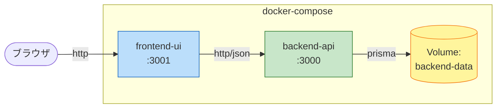

# Unit of Work Dependencies

**プロジェクト**: 請求書チェック・承認Webシステム
**作成日**: 2026-05-04

---

## 1. ユニット間依存マトリクス

| ↓依存元 / 依存先→ | backend-api | frontend-ui | SQLite |
|---|---|---|---|
| **backend-api**  | -          | (なし)      | ✓ (Prisma) |
| **frontend-ui**  | ✓ (HTTP/REST) | -        | (アクセスしない) |
| **SQLite**       | -          | -           | -           |

### 1.1 凡例
- ✓ : 依存あり
- (なし) : 依存なし
- - : 該当なし

---

## 2. 依存の詳細

### 2.1 frontend-ui → backend-api
- **プロトコル**: HTTP/1.1 (REST)
- **データ形式**: JSON
- **認証**: ヘッダー (`X-Actor-Id`, `X-Approver-Id`)
- **契約**: `api-contract.md` (バージョンなし、`/api/...`)
- **CORS**: backend-api 側の `CORS_ALLOW_ORIGIN` (デフォルト `http://localhost:3001`)
- **エラーフォーマット**: `{ "error": "..." }` + 適切な HTTP ステータスコード
- **環境変数**: `VITE_API_BASE_URL` (デフォルト `http://localhost:3000`)

### 2.2 backend-api → SQLite
- **アクセス手段**: Prisma Client (`@prisma/client`)
- **接続文字列**: `DATABASE_URL=file:/data/invoices.db` (Docker ボリューム)
- **マイグレーション**: `prisma migrate deploy` をコンテナ起動時に実行
- **トランザクション**: `prisma.$transaction([...])` で AuditLog 記録と Invoice 操作をアトミック化

---

## 3. デプロイ依存



### 3.1 起動順序の制約
- `docker-compose up` 時、`backend-api` は SQLite ボリュームに依存(自動的に作成・マウント)
- `frontend-ui` は `backend-api` の起動を待たなくても起動可(初回API呼び出し時に通信)
- 推奨: `depends_on` で `backend-api` の `service_healthy` を `frontend-ui` の起動条件にする

### 3.2 docker-compose 依存定義 (将来の Infrastructure Design で詳細化)
```yaml
services:
  backend-api:
    build: ./backend
    ports: ["3000:3000"]
    healthcheck:
      test: ["CMD", "wget", "-qO-", "http://localhost:3000/api/health"]
      interval: 10s
      timeout: 3s
      retries: 5
    volumes: ["backend-data:/data"]

  frontend-ui:
    build: ./frontend
    ports: ["3001:3001"]
    environment:
      VITE_API_BASE_URL: http://localhost:3000
    depends_on:
      backend-api:
        condition: service_healthy

volumes:
  backend-data:
```

(具体的な値は Infrastructure Design ステージで確定)

---

## 4. ビルド依存

| ユニット | ビルドコマンド | 出力 | 依存ツール |
|---|---|---|---|
| backend-api  | `npm ci && npx prisma generate && npm run build` | `.next/` ディレクトリ | Node 20+, npm |
| frontend-ui  | `npm ci && npm run build` | `dist/` ディレクトリ (静的ファイル) | Node 20+, npm |

両者とも独立にビルド可能。並列ビルドが可能。

---

## 5. テスト依存

| ユニット | テストコマンド | 依存物 |
|---|---|---|
| backend-api  | `npm test` (Vitest) | テスト用 SQLite (`file::memory:?cache=shared`) または分離DBファイル |
| frontend-ui  | `npm test` (Vitest + RTL) | DOM (jsdom)、apiClient はモック |

両ユニットのテストは独立実行可能。フロントは backend-api を**実起動しない**(モック使用)。

---

## 6. リスクと緩和策

| リスク | 影響 | 緩和策 |
|---|---|---|
| API契約のドリフト (フロントとバックで不一致) | 統合時バグ | api-contract.md を Single Source of Truth とし、両ユニットで参照する |
| 型定義の二重メンテ | 軽微なメンテコスト | API契約変更時は両ユニット両方を更新するルールをチェックリスト化 |
| CORS 設定漏れ | フロントから API 呼べない | docker-compose で `CORS_ALLOW_ORIGIN` を一元管理、起動確認をREADMEで案内 |
| SQLite ファイルロック | 同時アクセス問題 | PoC 規模 (同時10ユーザー) では問題なし、PRAGMA journal_mode=WAL を設定 |
