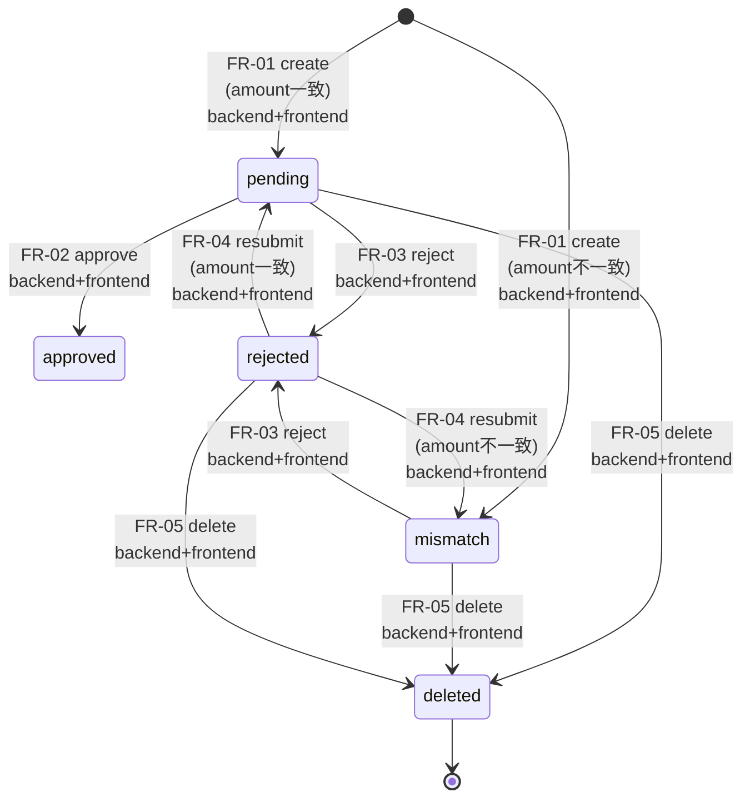

# Unit of Work - Story / Requirement Map

**プロジェクト**: 請求書チェック・承認Webシステム
**作成日**: 2026-05-04

User Stories ステージはスキップしているため、本ドキュメントでは **要件 (FR-XX)** をストーリー相当として、ユニットへの割当を示す。

---

## 1. 要件ユニット割当マトリクス

| 要件ID | 要件サマリ | backend-api | frontend-ui |
|---|---|:---:|:---:|
| **FR-01** | 請求書登録 (重複チェック、mismatch自動判定) | ✓ (POST /api/invoices) | ✓ (登録フォーム画面) |
| **FR-02** | 請求書承認 (mismatch不可、approver/approved_at記録) | ✓ (POST /:id/approve) | ✓ (詳細画面アクション) |
| **FR-03** | 請求書差戻し (rejection_reason必須) | ✓ (POST /:id/reject) | ✓ (差戻ダイアログ) |
| **FR-04** | 差戻し後の再提出 (rejected→pending/mismatch) | ✓ (PATCH /:id/resubmit) | ✓ (詳細編集モード) |
| **FR-05** | 請求書削除 (approved不可) | ✓ (DELETE /:id) | ✓ (削除ボタン+確認) |
| **FR-06** | ステータス検索 (一覧API) | ✓ (GET /api/invoices) | ✓ (一覧画面+フィルタ) |
| **FR-07** | 監査ログ記録 | ✓ (DB書き込み、AuditLogService) | × (UI不要、Out of Scope) |
| **FR-07b** | 監査ログ取得 (運用向けAPI) | ✓ (GET /api/audit-logs) | × (UIなし) |

---

## 2. ペルソナ別ユーザージャーニー → ユニット担当

### 2.1 経理担当 (Accountant)

| ステップ | 操作 | UI | API |
|---|---|---|---|
| 1 | ログイン (X-Actor-Id 設定) | frontend (右上の Actor 切替) | - |
| 2 | 請求書一覧を確認 | frontend (一覧画面) | backend (GET /api/invoices) |
| 3 | 取引先からの請求書を登録 | frontend (登録画面) | backend (POST /api/invoices) |
| 4 | 金額不一致 (mismatch) を発見 | frontend (status badge) | backend (status: mismatch) |
| 5 | mismatch 請求書を差戻し | frontend (差戻ダイアログ) | backend (POST /:id/reject) |
| 6 | 取引先から修正版受領 → 再提出 | frontend (詳細編集モード) | backend (PATCH /:id/resubmit) |

### 2.2 承認者 (Approver)

| ステップ | 操作 | UI | API |
|---|---|---|---|
| 1 | ログイン (X-Approver-Id 設定) | frontend | - |
| 2 | 承認待ち一覧表示 (status=pending) | frontend (フィルタ) | backend (GET /api/invoices?status=pending) |
| 3 | 詳細を確認 | frontend (詳細画面) | backend (GET /api/invoices/:id) |
| 4 | 承認 | frontend (承認ボタン) | backend (POST /:id/approve) |

### 2.3 監査担当 (Auditor)

| ステップ | 操作 | UI | API |
|---|---|---|---|
| 1 | 監査ログ取得 | × (Out of Scope) | backend (GET /api/audit-logs) を直接叩く (curl/Postman想定) |

---

## 3. ステータス遷移とユニットの関連

---

## 4. ユニット別実装スコープ サマリ

### backend-api が持つ実装範囲
- すべての FR (FR-01〜FR-07b)
- 状態遷移ロジック・ビジネスルール
- 監査ログの記録と取得
- 入力バリデーション (Zod)
- DB スキーマ・マイグレーション
- ヘルスチェック (`/api/health`)

### frontend-ui が持つ実装範囲
- FR-01〜FR-06 のユーザー操作 UI (FR-07 監査ログ閲覧UIは Out of Scope)
- 一覧 / 登録 / 詳細 (承認・差戻・再提出) の3画面
- ステータスバッジ・トースト通知・確認ダイアログ
- API クライアント (apiClient)
- フォームバリデーション (Zod、サーバーサイドのフォールバックあり)

---

## 5. 受入基準 → ユニット対応

requirements.md §10 受入基準のうち:

| 受入基準 | backend-api | frontend-ui |
|---|:---:|:---:|
| docker-compose up でフロント・バック・DBが起動する | ✓ | ✓ |
| 請求書登録(金額一致 → pending、不一致 → mismatch) | ✓ | ✓ |
| 同一 vendor_id + invoice_number の重複登録が拒否される | ✓ | ✓ (エラー表示) |
| mismatch の請求書を承認しようとすると拒否される | ✓ | ✓ (UIで承認不可表示) |
| 承認時に approver_id と approved_at が記録される | ✓ | - |
| 差戻し時に rejection_reason 必須が強制される | ✓ | ✓ (ダイアログで必須化) |
| rejected → 編集再提出 → pending または mismatch | ✓ | ✓ |
| ステータスでフィルタした一覧APIが動作する | ✓ | ✓ |
| 主要操作が監査ログに記録される | ✓ | - |
| 正常系・異常系のユニットテストが全て成功する | ✓ | ✓ |
| 型チェック・Lintが成功する | ✓ | ✓ |
| README手順だけで第三者がセットアップ・動作確認できる | ✓ | ✓ (Build & Test 段階) |
| package-lock.json が生成済、Dockerfileで `npm ci` 使用 | ✓ | ✓ |
