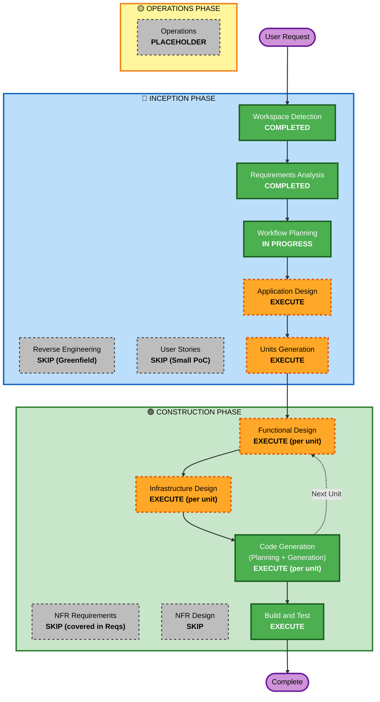

# Execution Plan

**プロジェクト**: 請求書チェック・承認Webシステム
**作成日**: 2026-05-04
**Project Type**: Greenfield

---

## 1. Detailed Analysis Summary

### 1.1 Change Impact Assessment
| 影響領域 | 有無 | 内容 |
|---|---|---|
| User-facing changes | Yes | 新規Webシステム、UI画面 (3-4画面) |
| Structural changes | Yes | フロント/バック完全分離、コンテナ構成 |
| Data model changes | Yes | Invoice / AuditLog 新規テーブル |
| API changes | Yes | 新規API群(登録、承認、差戻、検索、再提出) |
| NFR impact | Yes | 性能 (小規模)、セキュリティ (簡易認証)、運用 (Docker起動) |

### 1.2 Risk Assessment
| 項目 | 評価 |
|---|---|
| **Risk Level** | Low (PoC、社内利用、小規模) |
| **Rollback Complexity** | Easy (新規プロジェクト、コンテナ再起動で復元可) |
| **Testing Complexity** | Simple (ユニットテストのみ、DBはSQLite) |

### 1.3 主要な技術的判断ポイント
- 状態遷移ロジック (pending/approved/rejected/mismatch) はFunctional Designで明確化が必要
- フロント/バック分離構成のため、API契約を先に確立する必要がある
- docker-compose構成をInfrastructure Designで明確化

---

## 2. Workflow Visualization

---

## 3. Phases to Execute

### 🔵 INCEPTION PHASE
- [x] **Workspace Detection** — COMPLETED
- [ ] ~~Reverse Engineering~~ — SKIP
  - **Rationale**: Greenfieldプロジェクト、既存コードなし
- [x] **Requirements Analysis** — COMPLETED
- [ ] ~~User Stories~~ — SKIP
  - **Rationale**: 小規模PoC、要件が明確、ユーザペルソナはrequirements.mdに記述済み
- [x] **Workflow Planning** — IN PROGRESS
- [ ] **Application Design** — EXECUTE
  - **Rationale**: 新規コンポーネント定義、API契約、design.md (FSI参考デザインガイド) の作成が必要
- [ ] **Units Generation** — EXECUTE
  - **Rationale**: フロント・バックを別ユニットとして並列開発するため

### 🟢 CONSTRUCTION PHASE
- [ ] **Functional Design** — EXECUTE (per unit)
  - **Rationale**: 状態遷移ロジック、ビジネスルール (重複チェック、mismatch判定、approve可否) の詳細設計が必要
- [ ] ~~NFR Requirements~~ — SKIP
  - **Rationale**: NFRはRequirements Analysisで既に定義済み (PoC、小規模、簡易認証)
- [ ] ~~NFR Design~~ — SKIP
  - **Rationale**: NFR Requirements未実行のため
- [ ] **Infrastructure Design** — EXECUTE (per unit)
  - **Rationale**: docker-compose構成、コンテナ間通信、ボリューム永続化を明確化
- [ ] **Code Generation** — EXECUTE (per unit, ALWAYS)
  - **Rationale**: 実装が必要
- [ ] **Build and Test** — EXECUTE (ALWAYS)
  - **Rationale**: ビルド・テストの実行・検証

### 🟡 OPERATIONS PHASE
- [ ] Operations — PLACEHOLDER

---

## 4. Estimated Timeline
- **Total Stages to Execute**: 6 stages (Application Design + Units Generation + per-unit Functional Design + Infrastructure Design + Code Generation + Build and Test)
- **Estimated Units**: 2 (backend-api, frontend-ui)
- **Estimated Duration**: 並列処理を活用した中規模開発

---

## 5. Success Criteria

### Primary Goal
請求書登録・承認・差戻し・監査ログ・状態遷移の機能をAPIとUIの両方で動作させる。

### Key Deliverables
- フロントエンドコード (React + Vite)
- バックエンドコード (Next.js Route Handlers + Prisma)
- Prismaスキーマ + マイグレーション (SQLite)
- ユニットテスト (正常系・異常系)
- README.md (セットアップ手順、起動方法)
- API仕様書
- design.md (UIガイド)
- docker-compose.yml

### Quality Gates
- [ ] ビルド成功 (フロント・バック両方)
- [ ] テスト成功 (Vitest)
- [ ] Lint成功 (ESLint)
- [ ] 型チェック成功 (TypeScript)
- [ ] docker-compose によるローカル起動成功
- [ ] package-lock.json 生成済、Dockerfileで `npm ci` 使用
- [ ] レビュー指摘ゼロ または 人間判断待ち

---

## 6. Sub-Agent Strategy
CLAUDE.md要件「処理高速化のためサブエージェントを並列で活用」に基づき、以下のロールでサブエージェントを構成する。

| Agent | 役割 | 入力 | 出力 | 完了条件 |
|---|---|---|---|---|
| 設計エージェント | Application/Functional/Infrastructure Design | requirements.md | application-design.md, design.md, functional-design.md, infrastructure-design.md | 全設計書がレビュー観点を満たす |
| 実装エージェント | Code Generation (フロント/バック) | 設計書一式 | ソースコード、Prismaスキーマ | ビルド/型チェック成功 |
| テスト作成エージェント | Test generation | 設計書 + コード | Vitestテストケース | 正常系・異常系をカバー |
| レビューエージェント | 第三者レビュー | 設計書、コード、テスト | review-report.md | 全観点でレビュー実施 |
| 修正エージェント | レビュー指摘対応 | review-report.md | 修正後の成果物 | 全指摘解消または上限到達 |

並列実行可能な工程:
- Functional Design / Infrastructure Design は依存少ないため一部並列化可
- フロントとバックエンドのCode Generationは API契約確定後に並列実行
- レビューと実装は分離(同一エージェントを使わない)
